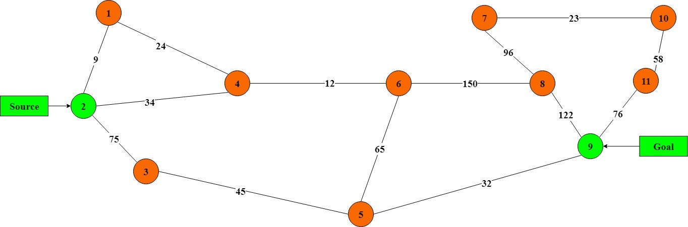

#Shortest-path-calculation-module-based-on-reinforcement-learning
------------
Here I have attempted to implement an off-the-shelf shortest path calculation module, based on reinforcement learning (Q learning). This Python based module has easy-to-use methods which can be fitted into any scenario including SDN. The module has been written very similar to networkx module so that users have the convenience of switching between two modules. Following methods are implemented in the module.

| Method | Functionality  |
| ------------ | ------------ |
| add_node(a)  | adds a node to the network graph |
| remove_node(a)  | adds a node to the network graph  |
| add_edge(a,b)  | adds an edge between nodes a and b  |
| remove_edge(a,b)  | removes the edge between a and b  |
| shortest_path(a,b) | returns the shortest path between a and b  |
| print_graph()  | returns the network graph  |

##### An implementation is given in main.py based on the following network.

